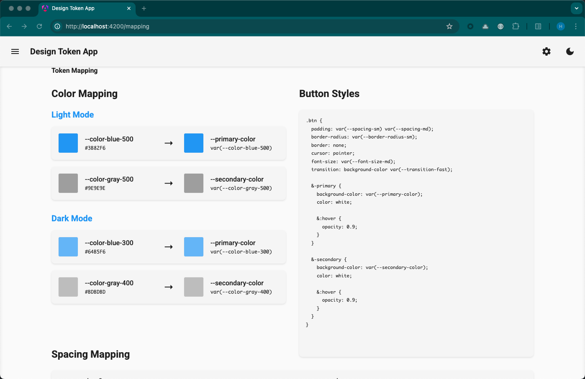
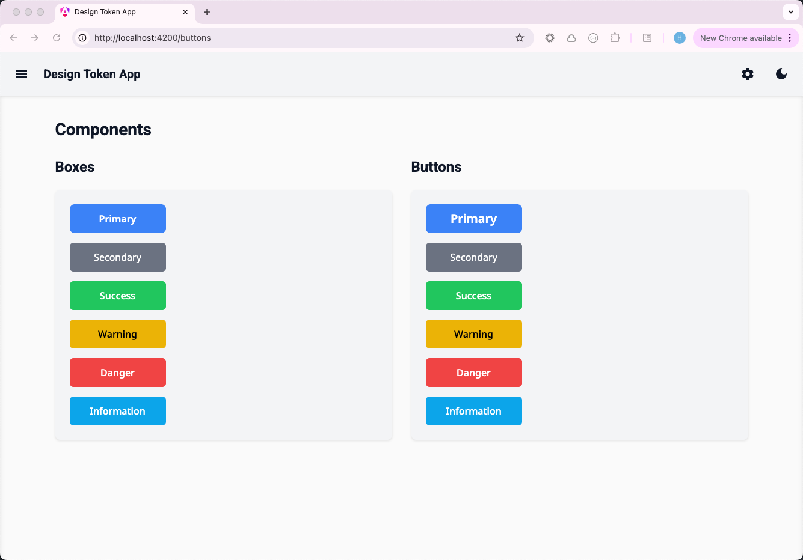

# DesignTokenApp

A modern Angular application for managing and visualizing design tokens. This project helps teams maintain consistent design systems by providing a centralized platform for managing design tokens. Design tokens are the building blocks of a design system, representing design decisions like colors, spacing, typography, and more.

## What are Design Tokens?

Design tokens are the smallest, indivisible parts of a design system. They represent design decisions like:
- Colors
- Typography (font sizes, weights, line heights)
- Spacing
- Border radiuses
- Shadows
- Animation durations
- And more

By using design tokens, teams can maintain consistency across their products and make global design changes efficiently.

## Features

- **Design Token Management**
  - Create, edit, and delete design tokens
  - Organize tokens by categories and types
  - Import/export token definitions
  - Version control for token changes

- **Visualization Tools**
  - Real-time token preview
  - Color palette visualization
  - Typography scale display
  - Spacing system visualization
  - Interactive token documentation

- **Theme Support**
  - Light and dark theme switching
  - Theme-aware components
  - Custom theme creation

- **Component Library**
  - Pre-built components using design tokens
  - Component variants (primary, secondary, success, warning, danger, information)
  - Responsive layouts
  - Navigation drawer
  - Settings panel

## Tech Stack

- **Frontend Framework**: Angular 19.2.0
- **Styling**: SCSS with CSS Custom Properties
- **Testing**: Jasmine and Karma
- **Build Tools**: Angular CLI 19.2.11
- **Package Manager**: npm
- **TypeScript**: 5.7.2
- **RxJS**: 7.8.0

## Prerequisites

- Node.js (LTS version recommended)
- npm (comes with Node.js)
- Angular CLI 19.2.11 or later

## Getting Started

1. Clone the repository:
```bash
git clone [repository-url]
cd design-token-app
```

2. Install dependencies:
```bash
npm install
```

3. Start the development server:
```bash
npm start
```

The application will be available at `http://localhost:4200/`.

## Available Scripts

- `npm start` - Starts the development server
- `npm run build` - Builds the project for production
- `npm run test` - Runs unit tests
- `npm run watch` - Builds the project and watches for changes

## Project Structure

```
src/
├── app/
│   ├── common/           # Shared components and tokens
│   │   ├── navigation/   # Header, Sidenav, Settings
│   │   └── tokens/       # Design token definitions
│   ├── pages/           # Application pages
│   │   ├── home/        # Home page
│   │   ├── tokens/      # Token management
│   │   ├── mapping/     # Token mapping
│   │   ├── buttons/     # Button examples
│   │   ├── components/  # Component library
│   │   ├── about/       # About page
│   │   └── contact/     # Contact page
│   ├── services/        # Application services
│   │   ├── styles.service.ts
│   │   └── theme.service.ts
│   └── app.component.ts # Root component
├── styles/              # Global styles
├── styles.scss         # Main stylesheet
├── main.ts            # Application entry point
└── index.html         # Main HTML file
```

## Design Token System

The application uses a comprehensive design token system defined in `src/app/common/tokens/`. This system provides a single source of truth for all design values used throughout the application.

### Token Categories

1. **Colors**
   ```scss
   /* Base Colors */
   --color-white:      #ffffff;
   --color-black:      #000000;
   --color-blue-100:   #dbeafe;
   --color-blue-200:   #bfdbfe;
   // ... more color shades

   /* Semantic Colors */
   --color-primary:              var(--color-blue-500);
   --color-secondary:            var(--color-gray-500);
   --color-success:              var(--color-green-500);
   --color-warning:              var(--color-yellow-500);
   --color-danger:               var(--color-red-500);
   --color-information:          var(--color-blue-400);

   /* Background Colors */
   --color-background-primary:   var(--color-primary);
   --color-background-secondary: var(--color-secondary);
   --color-background-success:   var(--color-success);
   --color-background-warning:   var(--color-warning);
   --color-background-danger:    var(--color-danger);
   --color-background-information: var(--color-information);

   /* Text Colors */
   --color-text-primary:         var(--color-white);
   --color-text-secondary:       var(--color-white);
   --color-text-success:         var(--color-white);
   --color-text-warning:         var(--color-black);
   --color-text-danger:          var(--color-white);
   --color-text-information:     var(--color-white);
   ```

2. **Typography**
   ```scss
   /* Font Sizes - Rem-based scale */
   --font-size-xs:                  0.25rem;    /* 4px */
   --font-size-sm:                  0.5rem;     /* 8px */
   --font-size-sl:                  0.75rem;    /* 12px */
   --font-size-md:                  1rem;       /* 16px */
   --font-size-lg:                  1.25rem;    /* 20px */
   --font-size-xl:                  1.5rem;     /* 24px */
   --font-size-2xl:                 1.75rem;    /* 28px */
   --font-size-3xl:                 2rem;       /* 32px */
   --font-size-4xl:                 2.25rem;    /* 36px */

   /* Font Weights */
   --font-weight-normal:            400;
   --font-weight-medium:            500;
   --font-weight-semibold:          600;
   --font-weight-bold:              700;

   /* Line Heights */
   --line-height-tight:             1.25;
   --line-height-normal:            1.5;
   --line-height-relaxed:           1.75;

   /* Font Family */
   --font-family-base: 'Noto Sans', -apple-system, BlinkMacSystemFont, 'Segoe UI', Roboto, Oxygen, Ubuntu, Cantarell, 'Open Sans', 'Helvetica Neue', sans-serif;
   ```

3. **Spacing**
   ```scss
   /* Material Design 3 Spacing Tokens */
   --md-spacing-0: 0px;
   --md-spacing-1: 4px;
   --md-spacing-2: 8px;
   --md-spacing-3: 12px;
   --md-spacing-4: 16px;
   --md-spacing-5: 20px;
   --md-spacing-6: 24px;
   --md-spacing-7: 28px;
   --md-spacing-8: 32px;
   --md-spacing-9: 36px;
   --md-spacing-10: 40px;
   --md-spacing-11: 44px;
   --md-spacing-12: 48px;
   --md-spacing-13: 52px;
   --md-spacing-14: 56px;
   --md-spacing-15: 60px;
   --md-spacing-16: 64px;
   --md-spacing-17: 68px;
   --md-spacing-18: 72px;
   --md-spacing-19: 76px;
   --md-spacing-20: 80px;

   /* Common Spacing Patterns */
   --md-spacing-xs:  var(--md-spacing-1);
   --md-spacing-sm:  var(--md-spacing-2);
   --md-spacing-md:  var(--md-spacing-4);
   --md-spacing-lg:  var(--md-spacing-6);
   --md-spacing-xl:  var(--md-spacing-8);
   --md-spacing-2xl: var(--md-spacing-12);
   --md-spacing-3xl: var(--md-spacing-16);
   --md-spacing-4xl: var(--md-spacing-20);
   ```

4. **Border Radius**
   ```scss
   /* Material Design 3 Radius Tokens */
   --md-radius-none:        0px;
   --md-radius-extra-small: 4px;
   --md-radius-small:       8px;
   --md-radius-medium:      12px;
   --md-radius-large:       16px;
   --md-radius-extra-large: 28px;
   --md-radius-full:        9999px;

   /* Common Radius Patterns */
   --md-radius-xs:          var(--md-radius-extra-small);
   --md-radius-sm:          var(--md-radius-small);
   --md-radius-md:          var(--md-radius-medium);
   --md-radius-lg:          var(--md-radius-large);
   --md-radius-xl:          var(--md-radius-extra-large);
   ```

5. **Shadows**
   ```scss
   /* Material Design 3 Shadow Tokens */
   --md-elevation-1: 0 1px  2px 0px rgba(0, 0, 0, 0.3),  0 1px 3px 1px rgba(0, 0, 0, 0.15);
   --md-elevation-2: 0 1px  2px 0px rgba(0, 0, 0, 0.3),  0 2px 6px 2px rgba(0, 0, 0, 0.15);
   --md-elevation-3: 0 4px  8px 3px rgba(0, 0, 0, 0.15), 0 1px 3px 0px rgba(0, 0, 0, 0.3);
   --md-elevation-4: 0 6px 10px 4px rgba(0, 0, 0, 0.15), 0 2px 3px 0px rgba(0, 0, 0, 0.3);
   --md-elevation-5: 0 8px 12px 6px rgba(0, 0, 0, 0.15), 0 4px 4px 0px rgba(0, 0, 0, 0.3);

   /* Common Shadow Patterns */
   --md-shadow-xs:         var(--md-elevation-1);
   --md-shadow-sm:         var(--md-elevation-2);
   --md-shadow-md:         var(--md-elevation-3);
   --md-shadow-lg:         var(--md-elevation-4);
   --md-shadow-xl:         var(--md-elevation-5);
   ```

6. **Sizing**
   ```scss
   /* Material Design Size Tokens */
   --md-size-xs:   2rem;    /* 32px */
   --md-size-sm:   4rem;    /* 64px */
   --md-size-md:   6rem;    /* 96px */
   --md-size-lg:   10rem;   /* 160px */
   --md-size-xl:   16rem;   /* 256px */
   --md-size-2xl:  26rem;   /* 416px */
   --md-size-3xl:  42rem;   /* 672px */

   /* Component Heights */
   --md-component-height-xs: 24px;
   --md-component-height-sm: 32px;
   --md-component-height-md: 40px;
   --md-component-height-lg: 48px;
   --md-component-height-xl: 56px;

   /* Container Sizes */
   --md-container-width-xs:  320px;
   --md-container-width-sm:  480px;
   --md-container-width-md:  640px;
   --md-container-width-lg:  960px;
   --md-container-width-xl:  1280px;
   ```

### Usage

Design tokens are implemented as CSS custom properties (variables) and can be used in two ways:

1. **In SCSS/CSS:**
```scss
.my-component {
  color: var(--color-primary);
  padding: var(--spacing-md);
  font-size: var(--font-size-base);
}
```

2. **In TypeScript:**
```typescript
import { COLOR_TOKENS, SPACING_TOKENS, TYPOGRAPHY_TOKENS } from '../common/tokens';

// Using tokens in components
const primaryColor = COLOR_TOKENS.background.PRIMARY;
const mediumSpacing = SPACING_TOKENS.MD;
const baseFontSize = TYPOGRAPHY_TOKENS.size.BASE;
```

### Theming

The design token system supports theming through CSS custom properties. The theme can be switched by adding a `data-theme` attribute to the root element:

```typescript
// Switch to dark theme
document.documentElement.setAttribute('data-theme', 'dark');

// Switch to light theme
document.documentElement.setAttribute('data-theme', 'light');
```

Theme-specific values are defined in CSS using the `[data-theme]` attribute selector:

```scss
:root {
  // Default (light) theme values
  --color-background-primary: #ffffff;
  --color-text-primary: #000000;
}

[data-theme="dark"] {
  // Dark theme values
  --color-background-primary: #1a1a1a;
  --color-text-primary: #ffffff;
}
```

### Component Variants

The styling system supports multiple component variants:
- Primary
- Secondary
- Success
- Warning
- Danger
- Information

For a complete list of available tokens, refer to `src/app/common/tokens/`.

### Component Styling System

The application includes a comprehensive component styling system that provides consistent and reusable styles across components. The system is built on top of the design tokens and follows a modular approach.

#### Component Structure

```mermaid
graph TD
    A[ax-primary] --> B[Base Styles]
    A --> C[Component Variants]
    A --> D[Component Sizes]
    A --> E[Component Spacing]
    A --> F[Component Visual Styles]
    A --> G[Component Typography]
    A --> H[Component Layout]

    B --> B1[Position: relative]
    B --> B2[Display: inline-flex]
    B --> B3[Align-items: center]
    B --> B4[Justify-content: center]
    B --> B5[Border: none]
    B --> B6[Outline: none]
    B --> B7[Cursor: pointer]

    C --> C1[Background: var(--color-background-primary)]
    C --> C2[Color: var(--color-text-primary)]

    D --> D1[ax-comp-xs]
    D --> D2[ax-comp-sm]
    D --> D3[ax-comp-md]
    D --> D4[ax-comp-lg]
    D --> D5[ax-comp-xl]

    E --> E1[Padding]
    E --> E2[Margin]
    E --> E3[Gap]

    F --> F1[Border Radius]
    F --> F2[Shadows]

    G --> G1[Font Size]
    G --> G2[Font Weight]
    G --> G3[Line Height]

    H --> H1[Width]
    H --> H2[Height]
    H --> H3[Min Height]
```

#### Usage Examples

1. **Basic Component with Primary Style**
```html
<ax-box [axClass]="'ax-primary'">
  Primary Box
</ax-box>
```

2. **Component with Size and Spacing**
```html
<ax-box [axClass]="'ax-primary ax-comp-lg ax-p-md'">
  Large Primary Box with Medium Padding
</ax-box>
```

3. **Component with Typography and Layout**
```html
<ax-box [axClass]="'ax-primary ax-text-lg ax-w-full'">
  Full-width Primary Box with Large Text
</ax-box>
```

#### Available Classes

1. **Component Variants**
   - `ax-primary`: Primary style with primary background and text colors
   - `ax-secondary`: Secondary style with secondary background and text colors
   - `ax-success`: Success style with success background and text colors
   - `ax-warning`: Warning style with warning background and text colors
   - `ax-danger`: Danger style with danger background and text colors
   - `ax-info`: Information style with information background and text colors

2. **Component Sizes**
   - `ax-comp-xs`: Extra small component size
   - `ax-comp-sm`: Small component size
   - `ax-comp-md`: Medium component size
   - `ax-comp-lg`: Large component size
   - `ax-comp-xl`: Extra large component size

3. **Spacing Utilities**
   - `ax-p-{size}`: Padding (xs, sm, md, lg, xl)
   - `ax-m-{size}`: Margin (xs, sm, md, lg, xl)
   - `ax-gap-{size}`: Gap between elements (xs, sm, md, lg, xl)

4. **Visual Styles**
   - `ax-r-{size}`: Border radius (none, sm, md, lg, xl, full)
   - `ax-s-{size}`: Shadow (none, sm, md, lg, xl)

5. **Typography**
   - `ax-text-{size}`: Font size (xs, sm, sl, md, lg, xl, 2xl, 3xl)
   - `ax-font-{weight}`: Font weight (light, normal, medium, semibold, bold)

6. **Layout**
   - `ax-w-{size}`: Width (xs, sm, md, lg, xl, 2xl, 3xl, full, auto, fit, min, max)
   - `ax-h-{size}`: Height (xs, sm, md, lg, xl, 2xl, 3xl, full, auto, fit, min, max)
   - `ax-min-h-{size}`: Minimum height (none, xs, sm, md, lg, xl, 2xl, 3xl, screen, full, fit, min, max)

#### Best Practices

1. **Class Combination**
   - Combine classes in a logical order: variant → size → spacing → typography → layout
   - Use the most specific class needed for the desired style
   - Avoid redundant classes

2. **Responsive Design**
   - Use appropriate size classes for different screen sizes
   - Consider using layout utilities for responsive behavior
   - Test components across different viewport sizes

3. **Theme Integration**
   - Components automatically adapt to theme changes
   - Use semantic color tokens for consistent theming
   - Test components in both light and dark themes

4. **Accessibility**
   - Ensure sufficient color contrast
   - Use appropriate text sizes for readability
   - Maintain consistent spacing for touch targets

## Contributing

1. Fork the repository
2. Create your feature branch (`git checkout -b feature/amazing-feature`)
3. Install dependencies (`npm install`)
4. Make your changes
5. Run tests (`npm test`)
6. Commit your changes (`git commit -m 'Add some amazing feature'`)
7. Push to the branch (`git push origin feature/amazing-feature`)
8. Open a Pull Request

### Development Guidelines

- Follow the Angular style guide
- Write unit tests for new features
- Update documentation for API changes
- Use conventional commits
- Keep PRs focused and small

## Additional Resources

- [Angular Documentation](https://angular.dev)
- [Angular CLI Overview](https://angular.dev/tools/cli)
- [Design Tokens Documentation](https://design-tokens.github.io/community-group/format/)

## License

This project is licensed under the MIT License - see the [LICENSE](LICENSE) file for details.

## Screenshots



